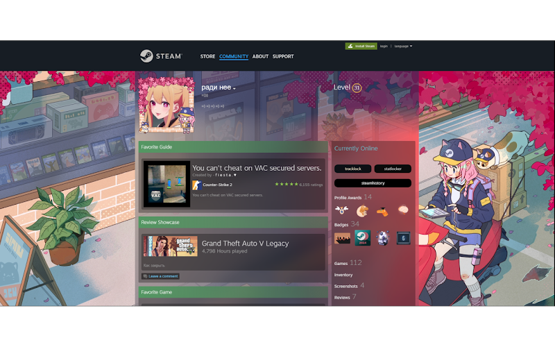
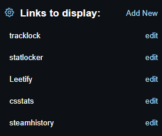
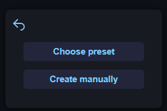
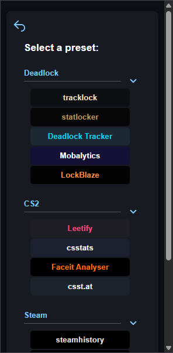
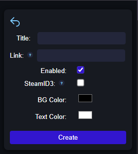

# Steam Stats Links

Extension adds customizable buttons to Steam profiles, which link to external sites with relevant info. You can easily select a preset or configure your own link and color formats.

## Features

- Add buttons linking to external stats sites directly in Steam profiles
- Choose from pre-defined presets or create your own custom links
- Customize the button colors
- Easy-to-use interface for managing links

## Installation

- 🟢 [Chrome Web Store](https://chromewebstore.google.com/detail/steam-stats-links/ojmmcmoegpnmepjokkdemcgiklaldcld)
- 🦊 [Firefox Add-ons](https://addons.mozilla.org/ru/firefox/addon/steam-stats-links/)

## Screenshots

**1. Buttons in Steam profile**

**2. Main page with selected sites**

**3. Add new page**

**4. Preset selection page**

**5. Manual link creation page**

## Contributing

Feel free to open issues or submit pull requests to improve the extension.

